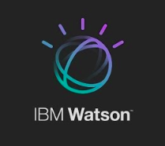
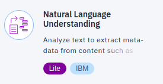
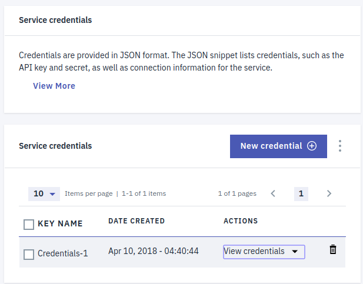
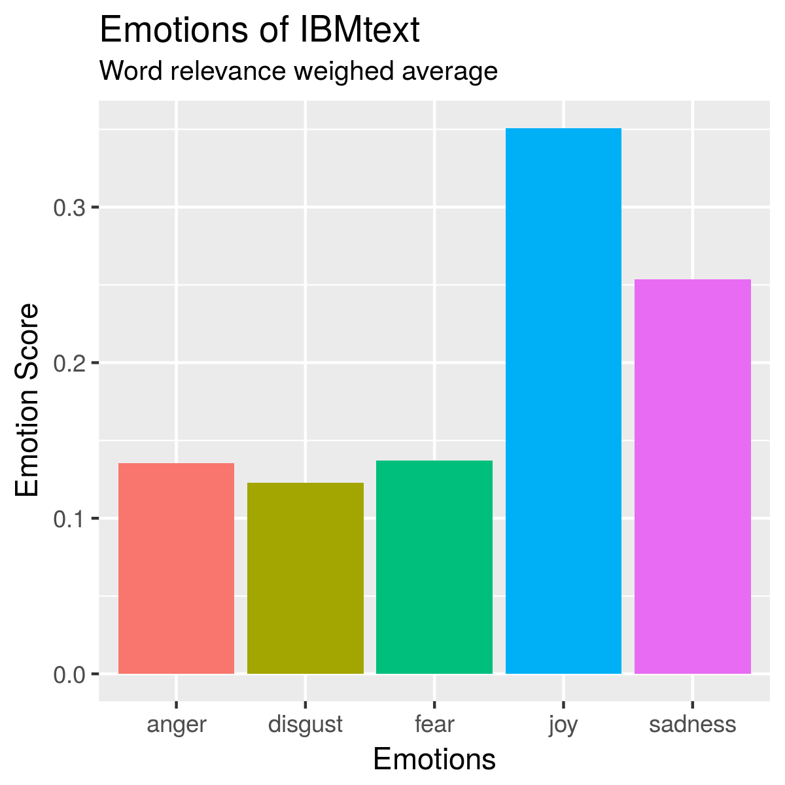
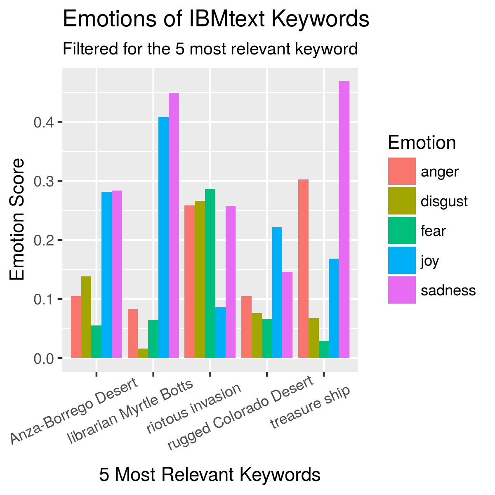

<h5 align="center">
  <br>
</a>
<br>
</h5>

<h4 align="center">An IBM Watson NLU API Wrapper package for R</a>.</h4>

<h5 align="center">
Created by</a></h5>

<h4 align="center">

[Johannes Harmse](https://github.com/johannesharmse) &nbsp;&middot;&nbsp;
[Simran Sethi](https://github.com/simrnsethi) &nbsp;&middot;&nbsp;
[Ted Haley](https://github.com/TedHaley) &nbsp;&middot;&nbsp;
[Veronique Mulholland](https://github.com/vmulholl)
</a></h4>

<br>
<h4 align="center">

[](https://github.com/johannesharmse/watsonNLU)
&nbsp;&nbsp;&nbsp;&nbsp;&nbsp;&nbsp;
[](https://github.com/johannesharmse/watsonNLU/network)&nbsp;&nbsp;&nbsp;&nbsp;&nbsp;&nbsp;
[](https://github.com/johannesharmse/watsonNLU/issues)&nbsp;&nbsp;&nbsp;&nbsp;&nbsp;&nbsp;
[](https://github.com/johannesharmse/watsonNLU/stargazers)&nbsp;&nbsp;&nbsp;&nbsp;&nbsp;&nbsp;
[](https://github.com/johannesharmse/watsonNLU/blob/master/LICENSE)
</a></h4>


<h1></h1>
<h4 align="center">
  <a href="#key-features">Key Features</a> &nbsp;&nbsp;&nbsp;•&nbsp;&nbsp;&nbsp;
  <a href="#installation">Installation</a> &nbsp;&nbsp;&nbsp;•&nbsp;&nbsp;&nbsp;
  <a href="#credits">Credits</a> &nbsp;&nbsp;&nbsp;•&nbsp;&nbsp;&nbsp;
  <a href="#related">Related</a> &nbsp;&nbsp;&nbsp;•&nbsp;&nbsp;&nbsp;
  <a href="#license">License</a>
</h4>
<h1></h1>

<br>

## Key Features

The `watsonNLU` R wrapper package integrates with the **IBM Watson Natural Language Understanding** service to produce a variety of outputs including:

* sentiment
* emotions
* categories
* relevance

Natural language processing analyses semantic features of the text while the Watson API cleans the HTML content so that the information can be handled by the R wrapper to produce a neat data frame output for each of the functions.  

### Package Functions

This section provides an overview of each of the functions. Please refer to <a href="#installation">Installation</a> for more usage details.

More information and examples can be found in the [User Manual](https://github.com/johannesharmse/watsonNLU/blob/master/vignettes/user_manual.md) and the [Installation Manual](https://github.com/johannesharmse/watsonNLU/blob/master/vignettes/install_manual.md). 

#### Authentication

The authentication function will take the credentials generated [here](https://console.bluemix.net/services/natural-language-understanding/3464cdba-a428-4934-945e-3dfd87d4e49c/?paneId=credentials&new=true&env_id=ibm:yp:us-south&org=89ae7f05-90ac-4efa-a089-e0a83704a79e&space=24853127-1fa6-4544-9835-e230bed91e8e) (you must be signed into your account).

```{r}
# Authenticate using Watson NLU API Credentials
auth_NLU(username, password)
```

As credential expire, you will have to create new ones following the steps delineated in the [Installation Manual](install_manual.Rmd). Before you create new credentials, try re-running `auth_NLU`.

#### Sentiment

Using the `keyword_sentiment` function is a useful tool for measuring the tone of a body of text. It could be used to assess the subjectivity of certain articles for instance by setting a threshold for neutral/objective text and comparing the polarization of articles on a similar topic.

```{r}
# Find the keywords and related sentiment score in the given text input.
sentiments <- keyword_sentiment(input = IBMtext, input_type='text')
head(sentiments)
```


#### Emotion

A standard example of a use case for `keyword_emotions` would be for expanding on the positive versus negative sentiments.


```{r}
# Find the keywords and related emotions in the given text input.
emotions <- keyword_emotions(input = IBMtext, input_type='text')
head(emotions)
```


#### Relevance

Relevance of specific keywords can be useful for determining what are the most recurring and pertinent terms of a document. To facilitate use, the `limit` argument can be set to return up to a specific number of keywords.

```{r}
# Top 5 keywords from the text input.
keyword_relevance(input = IBMtext, input_type='text', limit = 5)
```

```{r}
# Top 5 keywords from the URL input.
keyword_relevance(input = 'http://www.nytimes.com/guides/well/how-to-be-happy', input_type='url', limit = 5)
```

As we can see here, the keywords are locations and adventure related terms.


#### Category

User's may be interested in gathering the general topics of a text or the contents of a site very quickly.

```{r}
# Find 5 categories that describe the text input.
text_categories(input = IBMtext, input_type='text')
```

The results will return a variable number of themes that can be drilled down into category levels. The hierarchy will go from general topics to more specific subject matter as the level number increases.

## Installation

### Sign up with IBM and download R package

To use the Watson NLU API you must create an account with the IBM developper cloud.

1. Follow the link to the [Natural Language Understand](https://www.ibm.com/watson/developercloud/natural-language-understanding/api/v1/) page and follow the _Sign in to IBM Cloud_ link or click  ["Get Started Free"](https://console.bluemix.net/registration?target=%2Fcatalog%2Fservices%2Fnatural-language-understanding%3FhideTours%3Dtrue%26cm_mmc%3DOSocial_Tumblr-_-Watson%2BCore_Watson%2BCore%2B-%2BPlatform-_-WW_WW-_-wdc-ref%26cm_mmc%3DOSocial_Tumblr-_-Watson%2BCore_Watson%2BCore%2B-%2BPlatform-_-WW_WW-_-wdc-ref%26cm_mmca1%3D000000OF%26cm_mmca2%3D10000409_). Check your inbox to complete registration.

    


2. Use your credentials to log in and add the [Natural Language Understanding services](https://console.bluemix.net/catalog/services/natural-language-understanding) and click "Create".

3. Go to [Service credentials](https://console.bluemix.net/services/natural-language-understanding/3464cdba-a428-4934-945e-3dfd87d4e49c/?paneId=credentials&new=true&env_id=ibm:yp:us-south&org=89ae7f05-90ac-4efa-a089-e0a83704a79e&space=24853127-1fa6-4544-9835-e230bed91e8e) and create "New credentials".

    

4. Use these credentials as the username and password within the R wrapper authentication function {INSERT FUNCTION NAME HERE}

      

You can install watsonNLU in R from GitHub with:

``` r
# install.packages("devtools")
devtools::install_github("johannesharmse/watsonNLU")
```

### Example Workflow

The output provides a wealth of information that needs to be wrangled to display the highlights. We make use of the `dplyr` package to gather the emotions per keyword and display their score. This facilitates the plotting process with `ggplot2`. First off, let's summarize the emotions of the whole document weighing each keyword's emotions by its relevance:

```{r}
library(dplyr)
library(ggplot2)
library(tidyr)
```


```{r}
# wrangle the keywords to display a mean score proportional to the relevance
weighed_relevance <- emotions %>%
  gather(key = emotion, value = score, sadness, joy, fear, disgust, anger) %>%
  group_by(emotion) %>%
  summarize(mean.score= mean(score*key_relevance)) %>%
  mutate(mean.score = mean.score/sum(mean.score))

# display the results
ggplot(weighed_relevance, aes(x = emotion, y=mean.score, fill=emotion)) +
  geom_bar(stat = 'identity', position = "dodge") +
  labs(x = 'Emotions', y ='Emotion Score', title = 'Emotions of IBMtext', subtitle = "Word relevance weighed average") +
  scale_fill_discrete('Emotion') +
  guides(fill=FALSE)
  theme(axis.text.x = element_text(angle = 25, hjust = 0.7, vjust = 0.8))
```




```{r}
# gather and summarize the data grouped by most relevant keywords
emotions_long <- emotions %>%
  arrange(desc(key_relevance)) %>%
  head(5) %>%
  gather( key = emotion, value = score, sadness, joy, fear, disgust, anger) %>%
  group_by(keyword, emotion) %>% arrange(desc(score)) %>%
  summarize(mean.score=mean(score))

# display the 5 most relevant keywords and their emotion scores
ggplot(emotions_long, aes(x = keyword, y=mean.score, fill=emotion)) +
  geom_bar(stat = 'identity', position = "dodge") +
  labs(x = '5 Most Relevant Keywords', y ='Emotion Score', title = 'Emotions of IBMtext Keywords', subtitle = "Filtered for the 5 most relevant keyword") +
  scale_fill_discrete('Emotion') +
  theme(axis.text.x = element_text(angle = 25, hjust = 0.7, vjust = 0.8))
```



## Credits

* Adapted from an API wrapper project by [Johannes Harmse](https://github.com/johannesharmse/watsonNLU/blob/master/doc/references/api_lab.md)
* README structure borrowed from other R package project ([ptoolkit](https://github.com/UBC-MDS/ptoolkit))
  + formatting inspiration from  [Markdownify](https://github.com/amitmerchant1990/electron-markdownify/blob/master/README.md#key-features)
* Contributing conventions inspired from [@simrnsethi](https://github.com/simrnsethi)'s other R package ([regscoreR](https://github.com/UBC-MDS/regscoreR))
* Badges by [Shields IO](https://shields.io/)
* Logo by IBM Watson


## Related

### Package Dependencies

### Similar Packages

We found this package [WatsonR](https://github.com/rustyoldrake/WatsonR) to be another relevant API wrapper around IBM Watson API.

## License

[MIT License](https://github.com/johannesharmse/watsonNLU/blob/master/LICENSE)

## How to Contribute

**Interested in contributing?**

See our [Contributing Guidelines](https://github.com/johannesharmse/watsonNLU/blob/master/CONTRIBUTING.md) and [Code of Conduct](https://github.com/johannesharmse/watsonNLU/blob/master/CONDUCT.md).

---
<h6 align="center">
Created by

[Johannes Harmse](https://github.com/johannesharmse) &nbsp;&middot;&nbsp;
[Simran Sethi](https://github.com/simrnsethi) &nbsp;&middot;&nbsp;
[Ted Haley](https://github.com/TedHaley) &nbsp;&middot;&nbsp;
[Veronique Mulholland](https://github.com/vmulholl)
</a></h4>
