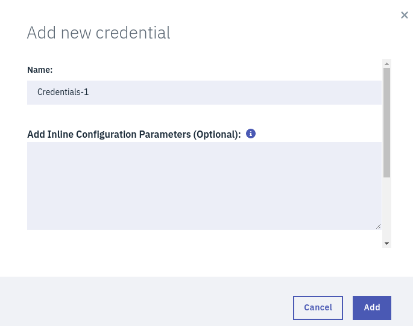

<h5 align="center">
  <br>
</a>
<br>
</h5>

<h4 align="center">An IBM Watson NLU API Wrapper package for R</a>.</h4>

<h5 align="center">
Created by</a></h5>

<h4 align="center">

[Johannes Harmse](https://github.com/johannesharmse) &nbsp;&middot;&nbsp;
[Simran Sethi](https://github.com/simrnsethi) &nbsp;&middot;&nbsp;
[Ted Haley](https://github.com/TedHaley) &nbsp;&middot;&nbsp;
[Veronique Mulholland](https://github.com/vmulholl)
</a></h4>

<br>
<h4 align="center">

[](https://github.com/johannesharmse/watsonNLU)
&nbsp;&nbsp;&nbsp;&nbsp;&nbsp;&nbsp;
[](https://github.com/johannesharmse/watsonNLU/network)&nbsp;&nbsp;&nbsp;&nbsp;&nbsp;&nbsp;
[](https://github.com/johannesharmse/watsonNLU/issues)&nbsp;&nbsp;&nbsp;&nbsp;&nbsp;&nbsp;
[](https://github.com/johannesharmse/watsonNLU/stargazers)&nbsp;&nbsp;&nbsp;&nbsp;&nbsp;&nbsp;
[](https://github.com/johannesharmse/watsonNLU/blob/master/LICENSE)
</a></h4>


<h1></h1>
<h4 align="center">
  <a href="#key-features">Key Features</a> &nbsp;&nbsp;&nbsp;•&nbsp;&nbsp;&nbsp;
  <a href="#installation">Installation</a> &nbsp;&nbsp;&nbsp;•&nbsp;&nbsp;&nbsp;
  <a href="#credits">Credits</a> &nbsp;&nbsp;&nbsp;•&nbsp;&nbsp;&nbsp;
  <a href="#related">Related</a> &nbsp;&nbsp;&nbsp;•&nbsp;&nbsp;&nbsp;
  <a href="#license">License</a>
</h4>
<h1></h1>

<br>

## Key Features

The `watsonNLU` R wrapper package integrates with the **IBM Watson Natural Language Understanding** service to produce a variety of outputs including:

* sentiment
* emotions
* categories
* relevance

Natural language processing analyses semantic features of the text while the Watson API cleans the HTML content so that the information can be handled by the R wrapper to produce a neat data frame output for each of the functions.  

### Package Functions

This section provides an overview of each of the functions. Please refer to <a href="#installation">Installation</a> for more usage details.

#### Authentication

The authentication function will take the credentials generated [here](https://console.bluemix.net/services/natural-language-understanding/3464cdba-a428-4934-945e-3dfd87d4e49c/?paneId=credentials&new=true&env_id=ibm:yp:us-south&org=89ae7f05-90ac-4efa-a089-e0a83704a79e&space=24853127-1fa6-4544-9835-e230bed91e8e) (you must be signed into your account).

#### Sentiment


#### Emotion


#### Relevance


## Installation

### Sign up with IBM and download R package

To use the Watson NLU API you must create an account with the IBM developper cloud.

1. Follow the link to the [Natural Language Understand](https://www.ibm.com/watson/developercloud/natural-language-understanding/api/v1/) page and follow the _Sign in to IBM Cloud_ link or click  ["Get Started Free"](https://console.bluemix.net/registration?target=%2Fcatalog%2Fservices%2Fnatural-language-understanding%3FhideTours%3Dtrue%26cm_mmc%3DOSocial_Tumblr-_-Watson%2BCore_Watson%2BCore%2B-%2BPlatform-_-WW_WW-_-wdc-ref%26cm_mmc%3DOSocial_Tumblr-_-Watson%2BCore_Watson%2BCore%2B-%2BPlatform-_-WW_WW-_-wdc-ref%26cm_mmca1%3D000000OF%26cm_mmca2%3D10000409_). Check your inbox to complete registration.

    


2. Use your credentials to log in and add the [Natural Language Understanding services](https://console.bluemix.net/catalog/services/natural-language-understanding) and click "Create".

3. Go to [Service credentials](https://console.bluemix.net/services/natural-language-understanding/3464cdba-a428-4934-945e-3dfd87d4e49c/?paneId=credentials&new=true&env_id=ibm:yp:us-south&org=89ae7f05-90ac-4efa-a089-e0a83704a79e&space=24853127-1fa6-4544-9835-e230bed91e8e) and create "New credentials".

    

4. Use these credentials as the username and password within the R wrapper authentication function {INSERT FUNCTION NAME HERE}

      

You can install watsonNLU in R from GitHub with:

``` r
# install.packages("devtools")
devtools::install_github("johannesharmse/watsonNLU")
```

### Example Workflow

TO BE EDITED WITH ATOMIC FUNCTION WORKFLOW.

``` r
#  original larger function
## watson_NLU(text = NULL, url = NULL, username = NULL, password=NULL, features = list(), version="?version=2018-03-16")

# example 1 -- leftist news
leftemotions <- watson_NLU(text = NULL, url = 'http://money.cnn.com/2018/04/02/technology/pacific-newsletter/index.html', username = 'YOUR CREDENTIALS HERE', password='YOUR CREDENTIALS HERE', features = list(keywords = list(sentiment = FALSE, emotion = TRUE)), version="?version=2018-03-16")

# example 1 -- rightist news
righttemotions <- watson_NLU(text = NULL, url = 'http://www.breitbart.com/big-government/2018/04/10/live-updates-mark-zuckerberg-testifies-before-congress/', username = 'YOUR CREDENTIALS HERE', password='YOUR CREDENTIALS HERE', features = list(keywords = list(sentiment = FALSE, emotion = TRUE)), version="?version=2018-03-16")
```

## Credits

* Adapted from an API wrapper project by [Johannes Harmse](https://github.com/johannesharmse/watsonNLU/blob/master/doc/references/api_lab.md)
* README structure borrowed from other R package project ([ptoolkit](https://github.com/UBC-MDS/ptoolkit))
  + formatting inspiration from  [Markdownify](https://github.com/amitmerchant1990/electron-markdownify/blob/master/README.md#key-features)
* Contributing conventions inspired from [@simrnsethi](https://github.com/simrnsethi)'s other R package ([regscoreR](https://github.com/UBC-MDS/regscoreR))
* Badges by [Shields IO](https://shields.io/)
* Logo by IBM Watson


## Related

### Package Dependencies

### Similar Packages

We found this package [WatsonR](https://github.com/rustyoldrake/WatsonR) to be another relevant API wrapper around IBM Watson API.

## License

[MIT License](https://github.com/johannesharmse/watsonNLU/blob/master/LICENSE)

## How to Contribute

**Interested in contributing?**

See our [Contributing Guidelines](https://github.com/johannesharmse/watsonNLU/blob/master/CONTRIBUTING.md) and [Code of Conduct](https://github.com/johannesharmse/watsonNLU/blob/master/CONDUCT.md).

---
<h6 align="center">
Created by

[Johannes Harmse](https://github.com/johannesharmse) &nbsp;&middot;&nbsp;
[Simran Sethi](https://github.com/simrnsethi) &nbsp;&middot;&nbsp;
[Ted Haley](https://github.com/TedHaley) &nbsp;&middot;&nbsp;
[Veronique Mulholland](https://github.com/vmulholl)
</a></h4>
