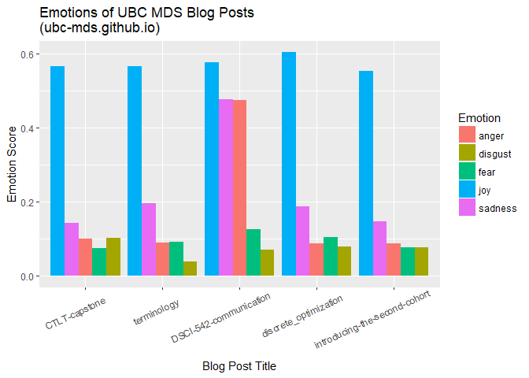
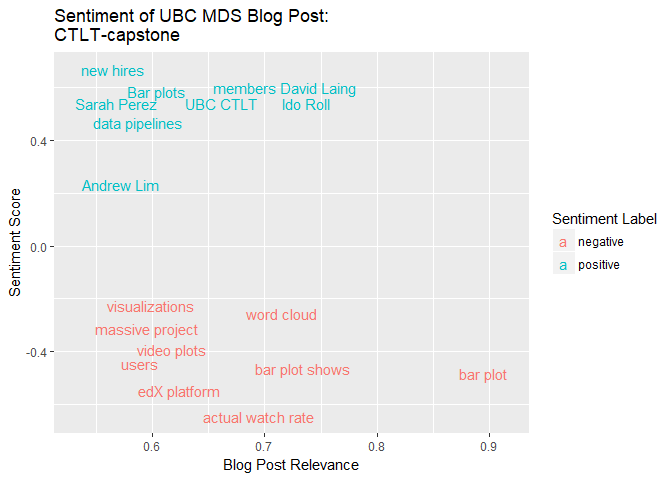
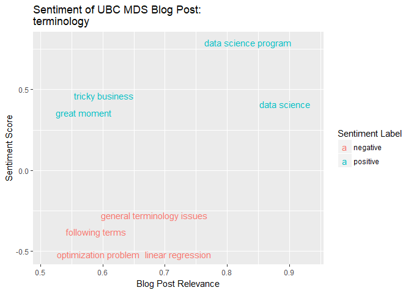
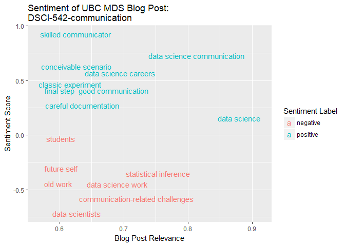
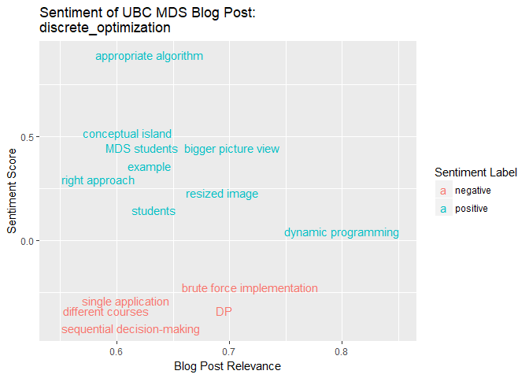
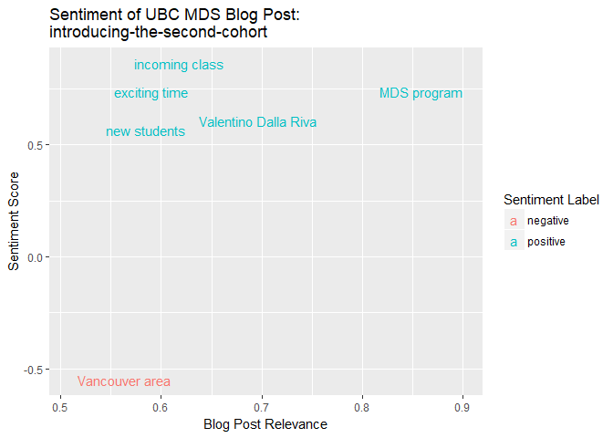
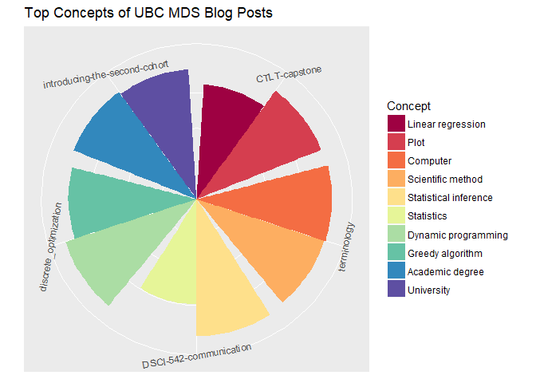

IBM Watson NLU API Examples
================
Johannes Harmse
April 09, 2018

The package uses IBM Watson's Natural Language Understanding API. The API documentation can be viewed [here](https://www.ibm.com/watson/developercloud/natural-language-understanding/api/v1/#post-analyze).

## Basic API Examples

Below we are using a webpage URL as the text to analyze. We are specifying that we want to determine the categories of the text, and we want to limit the output categories to a maximum of 5.

``` r
url <- "https://masterdatascience.science.ubc.ca/"


response <- GET(url=paste0(
              url_NLU,
              "/v1/analyze",
              version,
              "&url=", url,
              "&features=categories",
              "&categories.limit=5"),
        authenticate(username,password),
        add_headers("Content-Type"="application/json")
     )

content(response)$categories
```

    ## [[1]]
    ## [[1]]$score
    ## [1] 0.999984
    ##
    ## [[1]]$label
    ## [1] "/science"
    ##
    ##
    ## [[2]]
    ## [[2]]$score
    ## [1] 0.407417
    ##
    ## [[2]]$label
    ## [1] "/society"
    ##
    ##
    ## [[3]]
    ## [[3]]$score
    ## [1] 0.299769
    ##
    ## [[3]]$label
    ## [1] "/business and industrial/biomedical"

Instead of specifying an URL, we can specify raw text as a text string for analysis. Below we are extracting keywords with emotion and sentiment scores.

``` r
raw_text <- "I hate the rain. It is depressing."
text <- URLencode(raw_text)

response <- GET(url=paste0(
  url_NLU,
  "/v1/analyze",
  version,
  "&text=",text,
  "&features=keywords",
  "&keywords.emotion=true",
  "&keywords.sentiment=true"),
  authenticate(username,password),
  add_headers("Content-Type"="application/json")
)

content(response)$keywords
```

    ## [[1]]
    ## [[1]]$text
    ## [1] "rain"
    ##
    ## [[1]]$sentiment
    ## [[1]]$sentiment$score
    ## [1] -0.896058
    ##
    ## [[1]]$sentiment$label
    ## [1] "negative"
    ##
    ##
    ## [[1]]$relevance
    ## [1] 0.997678
    ##
    ## [[1]]$emotion
    ## [[1]]$emotion$sadness
    ## [1] 0.196758
    ##
    ## [[1]]$emotion$joy
    ## [1] 0.004451
    ##
    ## [[1]]$emotion$fear
    ## [1] 0.211476
    ##
    ## [[1]]$emotion$disgust
    ## [1] 0.085659
    ##
    ## [[1]]$emotion$anger
    ## [1] 0.749623

## API Wrapper Example - UBC MDS Blog Posts

The example below uses the API wrapper function. We want to scrape all the UBC MDS blog posts and analyze the content. We will be looking at sentiment, emotions and concepts of the blog posts.

``` r
url_scrape <- "https://ubc-mds.github.io/"

blogs <- read_html(url_scrape) %>%
  html_nodes("article a") %>%
  html_attr("href") %>%
  unique()

blogs <- paste0(url_scrape, blogs)
blogs
```

    ## [1] "https://ubc-mds.github.io//2018-01-01-CTLT-capstone/"                
    ## [2] "https://ubc-mds.github.io//2017-12-14-terminology/"                  
    ## [3] "https://ubc-mds.github.io//2017-11-10-DSCI-542-communication/"       
    ## [4] "https://ubc-mds.github.io//2017-10-18-discrete_optimization/"        
    ## [5] "https://ubc-mds.github.io//2017-09-01-introducing-the-second-cohort/"

We are applying the wrapper function within `lapply` function below.

``` r
mds <- lapply(blogs, function(x) watson_NLU(url = x, username = username, password = password,
                      features = list(keywords = list(sentiment=TRUE, categories=TRUE), concepts=list(), emotion=list())))

names(mds) <- blogs
```

Some data wrangling...

``` r
keywords <- NULL
concepts <- NULL
emotion <- NULL

for (i in 1:length(mds)){
  blog <- mds[[i]]
  blog_name <- substr(names(mds)[i], regexpr('[0-9]-[a-zA-Z]', text = names(mds)[i]) + 2, nchar(as.character(names(mds)[i]))-1)
  keywords <- rbind(keywords, data.frame('blog' = blog_name,
            'text' = sapply(1:length(blog$keywords), function(x) blog$keywords[[x]]$text),
            'relevance' = sapply(1:length(blog$keywords), function(x) blog$keywords[[x]]$relevance),
           'sentiment_score' = sapply(1:length(blog$keywords), function(x) blog$keywords[[x]]$sentiment$score),
           'sentiment_label' = sapply(1:length(blog$keywords), function(x) blog$keywords[[x]]$sentiment$label)))

  concepts <- rbind(concepts, data.frame('blog' = blog_name,
                                         'text' = sapply(1:length(blog$concepts), function(x) blog$concepts[[x]]$text),
           'relevance' = sapply(1:length(blog$concepts), function(x) blog$concepts[[x]]$relevance)))

  emotion <- rbind(emotion, data.frame('blog' = blog_name,
                                       'emotion' = names(blog$emotion$document$emotion),
                                       'emotion_score' = sapply(blog$emotion$document$emotion, function(x) x)))
}
```

We can visualize the function output in different ways.






