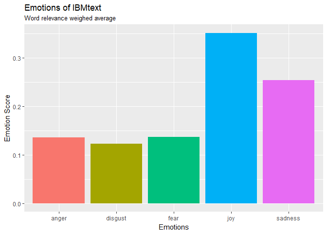
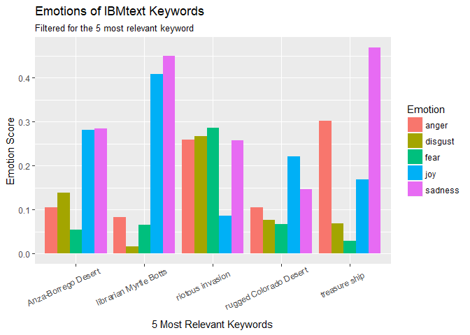

How to use watsonNLU?
================
J. Harmse, T. Haley, S. Sethi, V. Mulholland
2018-04-15

### Document Requirements

``` r
library(watsonNLU)
```

The steps below are only necessary for the authentication in this manual. No need to replicate.

``` r
# credentials saved locally 
credentials <- readRDS("../tests/testthat/credentials.rds")
username <- credentials$username
password <- credentials$password
```

Key Features
------------

The `watsonNLU` R wrapper package integrates with the **IBM Watson Natural Language Understanding** service to produce a variety of outputs including:

-   sentiment
-   emotions
-   categories
-   relevance

Natural language processing analyses semantic features of the text while the Watson API cleans the HTML content so that the information can be handled by the R wrapper to produce a neat data frame output for each of the functions.

### Package Functions

The following examples will help demonstrate the application of the NLU services through the use of a sample of text provided by IBM.

``` r
IBMtext <- "In the rugged Colorado Desert of California, there lies buried a treasure ship sailed there hundreds of years ago by either Viking or Spanish explorers. Some say this is legend; others insist it is fact. A few have even claimed to have seen the ship, its wooden remains poking through the sand like the skeleton of a prehistoric beast. Among those who say they’ve come close to the ship is small-town librarian Myrtle Botts. In 1933, she was hiking with her husband in the Anza-Borrego Desert, not far from the border with Mexico. It was early March, so the desert would have been in bloom, its washed-out yellows and grays beaten back by the riotous invasion of wildflowers. Those wildflowers were what brought the Bottses to the desert, and they ended up near a tiny settlement called Agua Caliente. Surrounding place names reflected the strangeness and severity of the land: Moonlight Canyon, Hellhole Canyon, Indian Gorge. Try Newsweek for only $1.25 per week To enter the desert is to succumb to the unknowable. One morning, a prospector appeared in the couple’s camp with news far more astonishing than a new species of desert flora: He’d found a ship lodged in the rocky face of Canebrake Canyon. The vessel was made of wood, and there was a serpentine figure carved into its prow. There were also impressions on its flanks where shields had been attached—all the hallmarks of a Viking craft. Recounting the episode later, Botts said she and her husband saw the ship but couldn’t reach it, so they vowed to return the following day, better prepared for a rugged hike. That wasn’t to be, because, several hours later, there was a 6.4 magnitude earthquake in the waters off Huntington Beach, in Southern California."
```

#### Authentication

The authentication function will take the credentials generated [here](https://console.bluemix.net/services/natural-language-understanding/3464cdba-a428-4934-945e-3dfd87d4e49c/?paneId=credentials&new=true&env_id=ibm:yp:us-south&org=89ae7f05-90ac-4efa-a089-e0a83704a79e&space=24853127-1fa6-4544-9835-e230bed91e8e) (you must be signed into your personal account).

With the credentials provided by IBM, enter your username and password. This step should be performed at the begining of every new intance. The following arguments are populated in `auth_NLU`:

<table>
<colgroup>
<col width="13%" />
<col width="86%" />
</colgroup>
<thead>
<tr class="header">
<th>Argument</th>
<th>Description</th>
</tr>
</thead>
<tbody>
<tr class="odd">
<td>username</td>
<td>Authentication IBM Watson Natural-Language-Understanding-3jusername</td>
</tr>
<tr class="even">
<td>password</td>
<td>Authentication IBM Watson Natural-Language-Understanding-3jpassword</td>
</tr>
</tbody>
</table>

``` r
# Authenticate using Watson NLU API Credentials
auth_NLU(username, password)
```

    ## [1] "Valid credentials provided."

As credential expire, you will have to create new ones following the steps delineated in the [Installation Manual](install_manual.Rmd). Before you create new credentials, try re-running `auth_NLU`.

#### Sentiment

The keyword\_sentiment function takes a text or URL input, along with the input type. The function then returns a dataframe containing the sentiments of the keywords extracted from the input, and the likelihood that the input is described by that sentiment.

<table>
<colgroup>
<col width="10%" />
<col width="89%" />
</colgroup>
<thead>
<tr class="header">
<th>Argument</th>
<th>Description</th>
</tr>
</thead>
<tbody>
<tr class="odd">
<td>input</td>
<td>Either a text string input or website URL. Either text or url argument has to be specified, but not both.</td>
</tr>
<tr class="even">
<td>input_type</td>
<td>Specify what type of input was entered. Either text or urlargument has to be specified, but not both.</td>
</tr>
<tr class="odd">
<td>version</td>
<td>The release date of the API version to use. Default value is version=&quot;?version=2018-03-16&quot;</td>
</tr>
</tbody>
</table>

##### Use Case

Using the `keyword_sentiment` function is a useful tool for measuring the tone of a body of text. It could be used to assess the subjectivity of certain articles for instance by setting a threshold for neutral/objective text and comparing the polarization of articles on a similar topic.

``` r
# Find the keywords and related sentiment score in the given text input.
sentiments <- keyword_sentiment(input = IBMtext, input_type='text')
head(sentiments)
```

    ##                  keyword key_relevance     score    label
    ## 1 rugged Colorado Desert      0.976091 -0.246817 negative
    ## 2 librarian Myrtle Botts      0.969207 -0.500747 negative
    ## 3    Anza-Borrego Desert      0.702170  0.000000  neutral
    ## 4       riotous invasion      0.698587  0.559545 positive
    ## 5          treasure ship      0.695311  0.000000  neutral
    ## 6       Moonlight Canyon      0.693246  0.313185 positive

#### Emotion

The `keyword_emotions` function takes a text or URL input, along with the input type. The function then returns a dataframe containing the emotions of the keywords extracted from the input, and the likelihood that the input is described by that emotion.

<table>
<colgroup>
<col width="10%" />
<col width="89%" />
</colgroup>
<thead>
<tr class="header">
<th>Argument</th>
<th>Description</th>
</tr>
</thead>
<tbody>
<tr class="odd">
<td>input</td>
<td>Either a text string input or website URL. Either text or url argument has to be specified, but not both.</td>
</tr>
<tr class="even">
<td>input_type</td>
<td>Specify what type of input was entered. Either text or urlargument has to be specified, but not both.</td>
</tr>
<tr class="odd">
<td>version</td>
<td>The release date of the API version to use. Default value is version=&quot;?version=2018-03-16&quot;</td>
</tr>
</tbody>
</table>

##### Use Case

A standard example of a use case for `keyword_emotions` would be for expanding on the positive versus negative sentiments.

``` r
# Find the keywords and related emotions in the given text input.
emotions <- keyword_emotions(input = IBMtext, input_type='text')
head(emotions)
```

    ##                  keyword key_relevance  sadness      joy     fear  disgust
    ## 1 rugged Colorado Desert      0.976091 0.146294 0.221358 0.066544 0.076084
    ## 2 librarian Myrtle Botts      0.969207 0.448906 0.407977 0.065132 0.016412
    ## 3    Anza-Borrego Desert      0.702170 0.283731 0.281543 0.054903 0.138030
    ## 4       riotous invasion      0.698587 0.257926 0.085886 0.286756 0.266443
    ## 5          treasure ship      0.695311 0.468585 0.168619 0.029721 0.067962
    ## 6       Moonlight Canyon      0.693246 0.132472 0.189404 0.080563 0.074394
    ##      anger
    ## 1 0.104871
    ## 2 0.082902
    ## 3 0.104731
    ## 4 0.258685
    ## 5 0.302241
    ## 6 0.083085

The output provides a wealth of information that needs to be wrangled to display the highlights. We make use of the `dplyr` package to gather the emotions per keyword and display their score. This facilitates the plotting process with `ggplot2`. First off, let's summarize the emotions of the whole document weighing each keyword's emotions by its relevance:

``` r
library(dplyr)
library(ggplot2)
library(tidyr)
```

``` r
# wrangle the keywords to display a mean score proportional to the relevance
weighed_relevance <- emotions %>%
  gather(key = emotion, value = score, sadness, joy, fear, disgust, anger) %>%
  group_by(emotion) %>%
  summarize(mean.score= mean(score*key_relevance)) %>% 
  mutate(mean.score = mean.score/sum(mean.score))

# display the results
ggplot(weighed_relevance, aes(x = emotion, y=mean.score, fill=emotion)) + 
  geom_bar(stat = 'identity', position = "dodge") + 
  labs(x = 'Emotions', y ='Emotion Score', title = 'Emotions of IBMtext', subtitle = "Word relevance weighed average") + 
  scale_fill_discrete('Emotion') +
  guides(fill=FALSE)
```



``` r
  theme(axis.text.x = element_text(angle = 25, hjust = 0.7, vjust = 0.8)) 
```

    ## List of 1
    ##  $ axis.text.x:List of 11
    ##   ..$ family       : NULL
    ##   ..$ face         : NULL
    ##   ..$ colour       : NULL
    ##   ..$ size         : NULL
    ##   ..$ hjust        : num 0.7
    ##   ..$ vjust        : num 0.8
    ##   ..$ angle        : num 25
    ##   ..$ lineheight   : NULL
    ##   ..$ margin       : NULL
    ##   ..$ debug        : NULL
    ##   ..$ inherit.blank: logi FALSE
    ##   ..- attr(*, "class")= chr [1:2] "element_text" "element"
    ##  - attr(*, "class")= chr [1:2] "theme" "gg"
    ##  - attr(*, "complete")= logi FALSE
    ##  - attr(*, "validate")= logi TRUE

``` r
# gather and summarize the data grouped by most relevant keywords
emotions_long <- emotions %>%
  arrange(desc(key_relevance)) %>%
  head(5) %>%
  gather( key = emotion, value = score, sadness, joy, fear, disgust, anger) %>%
  group_by(keyword, emotion) %>% arrange(desc(score)) %>%
  summarize(mean.score=mean(score))

# display the 5 most relevant keywords and their emotion scores
ggplot(emotions_long, aes(x = keyword, y=mean.score, fill=emotion)) + 
  geom_bar(stat = 'identity', position = "dodge") + 
  labs(x = '5 Most Relevant Keywords', y ='Emotion Score', title = 'Emotions of IBMtext Keywords', subtitle = "Filtered for the 5 most relevant keyword") + 
  scale_fill_discrete('Emotion') +
  theme(axis.text.x = element_text(angle = 25, hjust = 0.7, vjust = 0.8)) 
```



#### Relevance

The `keyword_relevance` function takes a text or URL input, along with the input type. The function then returns a dataframe that contains keywords and their likelihood of being a keyword, from the given input.

<table>
<colgroup>
<col width="10%" />
<col width="89%" />
</colgroup>
<thead>
<tr class="header">
<th>Argument</th>
<th>Description</th>
</tr>
</thead>
<tbody>
<tr class="odd">
<td>input</td>
<td>Either a text string input or website URL. Either text or url argument has to be specified, but not both.</td>
</tr>
<tr class="even">
<td>input_type</td>
<td>Specify what type of input was entered. Either text or urlargument has to be specified, but not both.</td>
</tr>
<tr class="odd">
<td>limit</td>
<td>The number of categories to return.</td>
</tr>
<tr class="even">
<td>version</td>
<td>The release date of the API version to use. Default value is version=&quot;?version=2018-03-16&quot;</td>
</tr>
</tbody>
</table>

##### Use Case

Relevance of specific keywords can be useful for determining what are the most recurring and pertinent terms of a document. To facilitate use, the `limit` argument can be set to return up to a specific number of keywords.

``` r
# Top 5 keywords from the text input.
keyword_relevance(input = IBMtext, input_type='text', limit = 5)
```

    ##                  keyword relevance
    ## 1 rugged Colorado Desert  0.976091
    ## 2 librarian Myrtle Botts  0.969207
    ## 3    Anza-Borrego Desert  0.702170
    ## 4       riotous invasion  0.698587
    ## 5          treasure ship  0.695311

``` r
# Top 5 keywords from the URL input.
keyword_relevance(input = 'http://www.nytimes.com/guides/well/how-to-be-happy', input_type='url', limit = 5)
```

    ##                      keyword relevance
    ## 1                  happiness  0.962492
    ## 2                     people  0.790289
    ## 3     World Happiness Report  0.610324
    ## 4               happier life  0.586591
    ## 5 so-called happiness ladder  0.540760

As we can see here, the keywords are locations and adventure related terms.

#### Category

The `text_categories` function takes a text or URL input along with the input type. The function then returns a dataframe that contains the likelihood that the contents of the URL or text belong to a particular category.

<table>
<colgroup>
<col width="10%" />
<col width="89%" />
</colgroup>
<thead>
<tr class="header">
<th>Argument</th>
<th>Description</th>
</tr>
</thead>
<tbody>
<tr class="odd">
<td>input</td>
<td>Either a text string input or website URL. Either text or url argument has to be specified, but not both.</td>
</tr>
<tr class="even">
<td>input_type</td>
<td>Specify what type of input was entered. Either text or urlargument has to be specified, but not both.</td>
</tr>
<tr class="odd">
<td>version</td>
<td>The release date of the API version to use. Default value is version=&quot;?version=2018-03-16&quot;</td>
</tr>
</tbody>
</table>

##### Use Case

User's may be interested in gathering the general topics of a text or the contents of a site very quickly.

``` r
# Find 5 categories that describe the text input.
text_categories(input = IBMtext, input_type='text')
```

    ##      score category_level_1     category_level_2
    ## 1 0.480819  home and garden                 <NA>
    ## 2 0.464129           travel tourist destinations
    ## 3 0.360872          science              geology
    ##             category_level_3 category_level_4
    ## 1                       <NA>             <NA>
    ## 2 mexico and central america             <NA>
    ## 3                 seismology      earthquakes

The results will return a variable number of themes that can be drilled down into category levels. The hierarchy will go from general topics to more specific subject matter as the level number increases.
